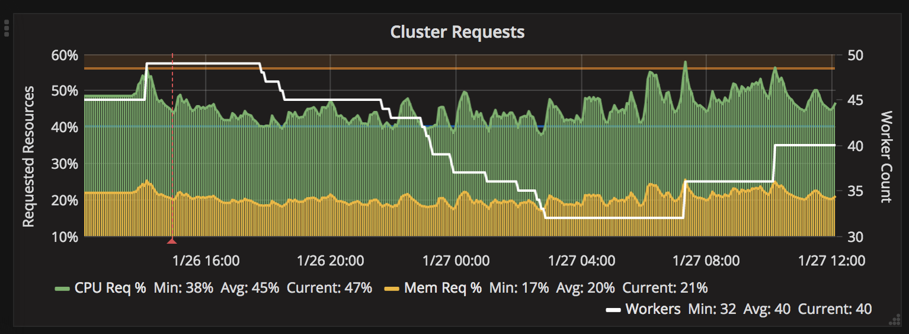

# Speculator
---

Speculator is an automated scaling service for AWS EC2 AutoScale Groups based
on Kubernetes Pod CPU/Memory Request Percentages of the cluster.

Default Ideal range is lower than typical solutions (40%-57%) because of the way
Deis deploys on my cluster.  Range is modifyable via environment variables.

### Building

I still build and deploy this in deis (aka: git push) but basic binary should be
buildable with a `go build -o speculator *.go`

### Running

Currently, its built to look at the Kubernetes internal API and will need a service 
account.  I'm not using RBAC at the moment because of Deis as well. 

It needs a few environment variables in order to run.  

	ASGROUPNAME     - AWS AutoScaler Group Name 
	AWSREGION       - AWS Region (default: us-east-1)
	ENABLED         - TRUE|FALSE Enable scaling to take place (default: False) 
	DISABLECOOLDOWN - TRUE|FALSE - Disable AWS ASG Cooldown timeout period 
	CPUWATERMARK    - CPU Requests Watermark Percentage, When to scale down (default:"40")
	CPUTHRESHOLD    - CPU Threshold Percentage, When to scale up (default:"56")
    AWS_ACCESS_KEY  - AWS KEY with permissions to ASG 
    AWS_SECRET_ACCESS_KEY - AWS KEY with permissions to ASG 

Prometheus metrics are exported (default port 5000 /metrics).  Metrics are prefixed with `speculator`

### Documentation

Thorough documentation is [on the wiki](https://github.com/undeadops/speculator/wiki).

### Example Prometheus Graph

### Contributing
Check out [CONTRIBUTING.md](./CONTRIBUTING.md) for notes on making contributions.

### License

This library is licensed under the Apache 2.0 License. 
